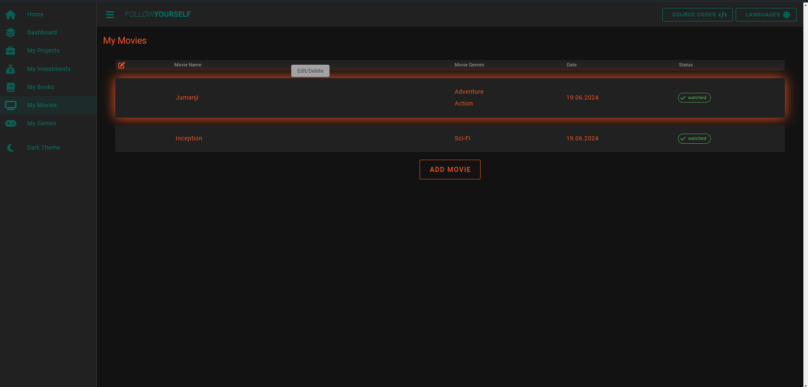
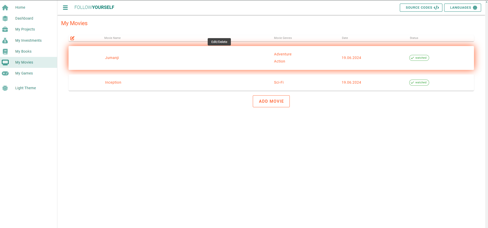

## Improve Yourself


## Features

- Follow your watch/watched movies
- Follow your played/playing games
- Follow your bought/sold investments
- Follow your ongoing/finished projects
- Follow your readed/reading books
- Upgrade yourself with my algorithms
- Dark/Light Mode
- English | Turkish | Japanese language support

## Dark Mode


## Light Mode


## Tablet View


## Mobile View


```markdown
## Installation

To clone the repository, run the following command:

```sh
git clone https://github.com/gokhankatar/improve-yourself


